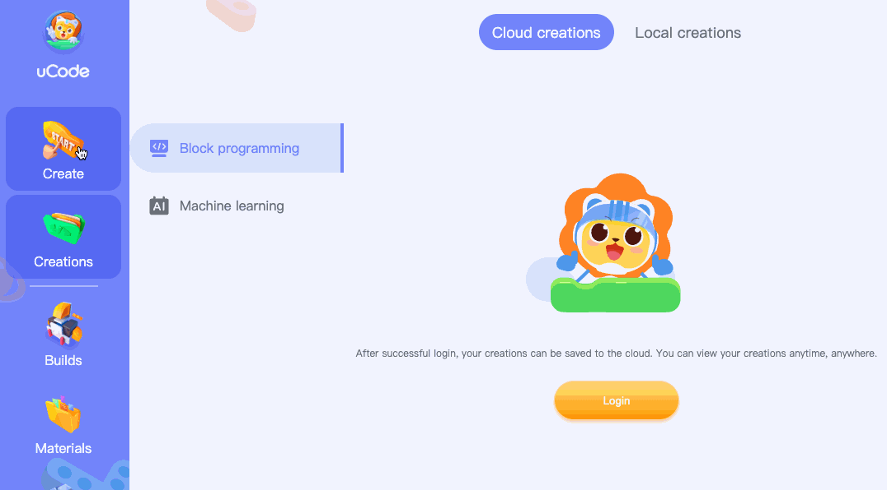

# uCode4 arduino extension

Read this in other languages: English | [简体中文](README.md)

## Getting started

Run the following steps to generate `ext.ucdext` file.

- step 1. initialize npm package

```bash
yarn
```

- step 2. build localization files

```bash
yarn i18n
```

- step 3. build extension

```bash
yarn compile
```

The path of extension target file is `dist/ext.ucdext`. It can be added in uCode4 by the following steps:
1. [open uCode4 page](https://code.ubtrobot.com/)
2. click `create`--`Block programming`
3. click `Hardware`--`Add hardware`
4. Right click on the blank space, then click the `Add developer plugins` menu
5. find and choose the `dist/ext.ucdext` file



## About open uCode

Go to "[Open uCode docs](https://aiedu.ubtrobot.com/open/docs/01-started/usv.html)" for more information.